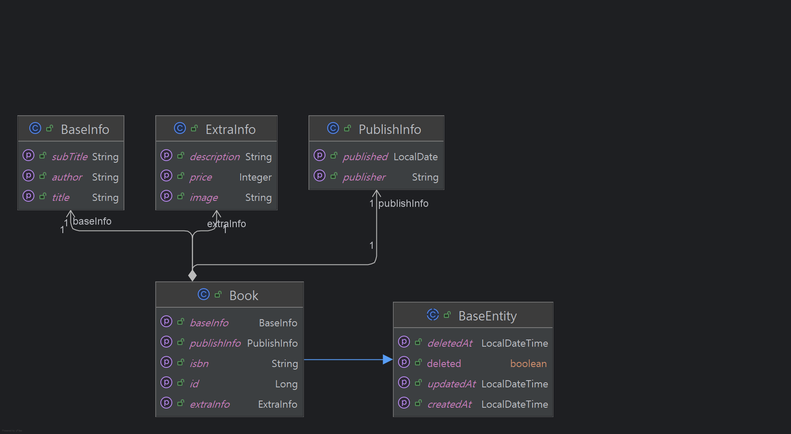

# Book Search API

## 프로젝트 소개
- 도서 데이터를 검색하는 기능을 제공하는 API 입니다.
- 제한된 시드 데이터 내에서 동작합니다.
  - Naver 도서 검색 API를 활용하여 만든 시드 데이터 100개를 추가하는 sql 파일이 서버가 실행할 때 함께 동작합니다. 

## 실행 방법
- 아래 작성된 명령어를 수행하여, 서버를 실행시키고 종료합니다.
```angular2html
# 프로젝트 클론
git clone https://github.com/HanaHww2/books.git
cd books

# 도커 컴포즈를 활용한 인프라 및 서버 실행
docker compose -f docker-compose.yml up -d --build

# 중지
docker compose -f docker-compose.yml down
# 볼륨 삭제도 하는 경우 -v 옵션 추가
# docker compose -f docker-compose.yml down -v
```

#### 옵션 - 시드 데이터 sql 생성 필요시
```angular2html
export NAVER_CLIENT_ID=your-id
export NAVER_CLIENT_SECRET=your-secret
./gradlew test --tests "*BookSqlExport*"
```

## Api Docs link 
- [프로젝트를 실행한 다음, 해당 링크로 접속해주세요.](http://localhost:8080/swagger-ui/index.html)
  - http://localhost:8080/swagger-ui/index.html
- 혹은 프로젝트 내 ./src/test/http 의 books.http 파일을 활용하여 e2e 테스트를 수행할 수 있습니다.

## 도메인 모델 구조 

- 도서 도메인을 단일 애그리거트로 하여 서비스를 구성했습니다.
  - 도서의 정보들 중 기본 정보(제목, 부제목, 작가명), 추가 정보(이미지url, 가격, 설명), 출간 정보(출간일, 출판사) 를 각각 VO로 분리하여 구성하였습니다.

## 기술 스택 및 선택 이유
### PostgreSQL
- PostgreSQL을 기본 데이터베이스로 선택하였습니다.
  - PostgreSQL은 full text search를 지원하는 데이터베이스로 역인덱스 방식을 통해 빠른 질의 검색을 지원합니다.
  - ElasticSearch 활용에 대해서도 고민하였으나, 현재 제가 가장 빠르게 작업을 수행할 수 있는 방향으로 기술을 선택하였으며, ElasticSearch로의 쿼리 DB 전환은 추가 개선안으로 남겨두기로 하였습니다.
    - PostgreSQL이 아쉽게도 다양한 분석기를 지원해주지는 않고, 서비스가 확장된다고 가정하면 조회와 쓰기 부하를 분산하기 위해서라도 ElasticSearch를 검색 엔진으로 활용할 필요성이 있을 것입니다.

### Redis
- Redis를 활용해 시간대별 인기 검색어 카운팅을 수행하고, TOP 10의 인기 검색어 조회 기능을 구현하였습니다.
  - 인메모리 기반의 레디스에 데이터를 저장함으로써, 실시간으로 들어오는 많은 검색 요청에 대한 카운팅을 빠르게 수행할 수 있을 뿐더러, 자주 조회되는 정보이므로 레디스를 활용하는 것이 적합하다고 생각하였습니다.
  - 더불어 Sorted Set 자료구조를 활용해, score에 따라 인기 순위 정렬이 가능하기에, TOP 10 정보를 빠르게 조회해오는데 유리하다고 생각했습니다.

## 아키텍처 결정 사항
- 프로젝트의 비즈니스 로직이 복잡해지면 코드가 특정 계층에 집중되거나, 각 계층 간의 의존성이 무분별하게 얽히는 문제가 발생할 수 있습니다. 이에 저는 시스템의 유지보수성과 확장성을 높이기 위해, 각 계층의 역할을 명확히 분리하고, 비즈니스 핵심 로직을 독립적으로 관리할 수 있는 구조인 DDD 4계층을 활용해 프로젝트를 구성하였습니다.

### 구성
- Presentation Layer: 사용자 요청을 처리하고 응답 데이터를 보여주는 계층
- Application Layer: 비즈니스 로직을 직접 구현하지 않고, 도메인 객체들을 조합하여 기능(Use Case)을 실행
- Domain Layer: 핵심 비즈니스 로직과 규칙을 담당 (엔티티, 값 객체, 애그리거트, 도메인 서비스 등 포함)
- Infrastructure Layer: 데이터베이스, 메시징, 파일 시스템 등 외부 시스템과의 통신을 담당

## 문제 해결 중 고민 과정
### 시드 데이터의 idFetcher 구현
- 현재 엔티티의 id 값을 시퀀스를 활용해 생성하는 것으로 구현해두었습니다. 
  - 이 때 hibernate에서는 기본적으로 시퀀스를 50개 단위로 증가시키며, 미리 아이디를 로드해와서 활용하는 방식으로 시퀀스 사용시 효율을 높이고 있습니다.
  - 시드 데이터를 생성할 때에도 시퀀스를 연속적으로 여러 개 쿼리해오는 방식을 적용했었는데, 이 경우에도 매 아이디가 50씩 점프하게 되는 문제를 확인하게 되었습니다.
  - 결과적으로 전체 데이터 크기 / 50 의 올림값 만큼 시퀀스를 가져오고, 미리 할당 받은 값을 기준으로 insert 쿼리를 생성할 수 있도록 하였습니다.

### 검색 연산자 별 처리에 전략 패턴 적용
- 검색 키워드의 경우, 현재 간단히 3가지 케이스(기본, or 연산, not 연산)로 분류할 수 있기에 불필요한 패턴의 도입이 아닐지 고민했으나, 추후 확장 가능성을 고려하였고 간단히 적용할 수 있는 수준이기에 전략 패턴을 도입하였습니다.

### PostgreSQL에 mecab-ko 분석기 설치 적용
- PostgreSQL에서 기본적으로 지원하는 토크나이저로는 정확한 검색 결과를 만들어낼 수 없겠다는 생각이 들어 인지도가 높은 mecab-ko 분석기를 도입하였습니다.

### Redis를 활용한 인기 검색어 조회 기능 구현
- 인기 검색어 기능 구현에서 rdb를 활용할 것인지 Redis를 활용할 것인지 고민하였습니다.
  - 그러나 인기 검색어의 경우 현재로서는 영속적인 데이터가 아니라고 판단했고, Redis의 SortedSet을 활용하여 간단히 구현할 수 있으며, 성능적인 측면에서도 효율적이라 생각해 이를 활용하게 되었습니다.

### 인기 검색어 데이터 파싱 방식
- 검색어의 경우 3가지 케이스(기본, or 연산, not 연산)가 존재하는데, 이 때, 어떤 형태로 카운팅을 하는 것이 좋을지 고민이 있었습니다.
  - 연산자를 포함한 검색어를 카운팅할지, 연산자를 제거한 각 검색어를 카운팅할지가 주된 고민이었습니다.
  - 사용자 입장에서 연산자를 제거한 검색어를 보여주는 것이 더 명확하게 와 닿을 것이라 생각해 연산자를 제거한 분절된 검색어를 카운팅하기로 결정하였습니다.
    - 그리고 or 연산의 경우에는 한꺼번에 2개를 검색하므로 기본 검색보다는 가중치를 낮게 주는 것이 좋겠다고 생각을 했는데, 명확한 기준을 잡기 힘들어 임시로 키워드 별로 가중치를 0.5 정도로 낮추어서 카운팅을 수행했습니다.

### 인기 검색어 정보 관련 DDD 적용
- 인기 검색어는 도서 애그리거트 루트와는 생명 주기가 다르고, 일종의 부가 기능에 가깝다는 생각이 들었습니다.
  - 이를 따로 분리해야 하나 고민을 했었는데, 도서 검색 키워드라는 도서 도메인에 종속적인 속성이 있으므로 하나의 도메인으로 합쳐서 만들어 두었습니다.
  - 추후 검색 관련 도메인이 커진다면, 검색 도메인으로 분리할 수 있으리라는 생각을 해보았습니다.